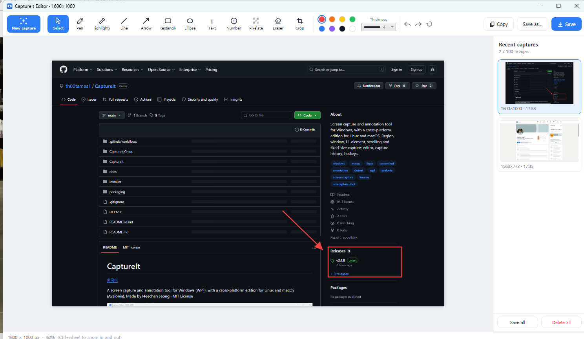
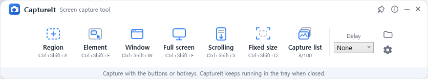
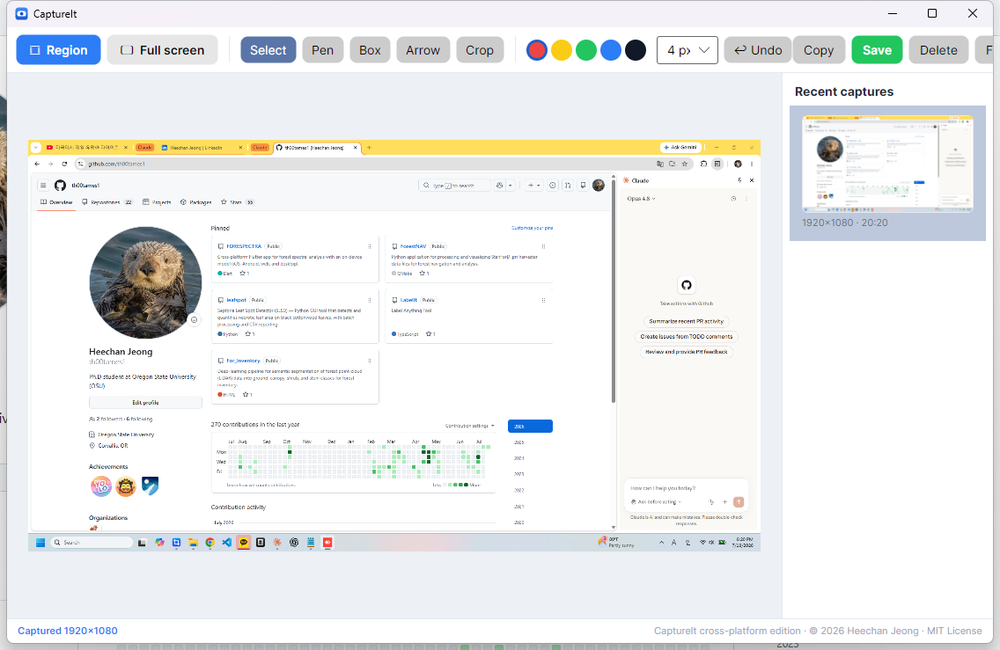

# CaptureIt

[한국어](README.ko.md)

A screen capture and annotation tool for Windows (WPF), with a cross-platform
edition for Linux and macOS (Avalonia).
Made by **Heechan Jeong** · MIT License



## Download & Install

**[⬇ Download the latest release](https://github.com/th00tames1/CaptureIt/releases/latest)**

| OS | File | How to install |
|---|---|---|
| **Windows 10/11** | [`CaptureIt-Setup-2.1.9-win-x64.exe`](https://github.com/th00tames1/CaptureIt/releases/download/v2.1.9/CaptureIt-Setup-2.1.9-win-x64.exe) | Run the installer. No administrator rights required. |
| Windows (portable) | [`CaptureIt-Portable-2.1.9-win-x64.zip`](https://github.com/th00tames1/CaptureIt/releases/download/v2.1.9/CaptureIt-Portable-2.1.9-win-x64.zip) | Unzip and run the exe |
| **Linux x64** | [`CaptureIt-2.1.9-linux-x64.tar.gz`](https://github.com/th00tames1/CaptureIt/releases/download/v2.1.9/CaptureIt-2.1.9-linux-x64.tar.gz) | Extract, then `./install.sh` |
| **macOS (Apple Silicon)** | [`CaptureIt-2.1.9-macos-apple-silicon.zip`](https://github.com/th00tames1/CaptureIt/releases/download/v2.1.9/CaptureIt-2.1.9-macos-apple-silicon.zip) | Unzip → **right-click → Open** |
| macOS (Intel) | [`CaptureIt-2.1.9-macos-intel.zip`](https://github.com/th00tames1/CaptureIt/releases/download/v2.1.9/CaptureIt-2.1.9-macos-intel.zip) | Unzip → **right-click → Open** |

> **Windows SmartScreen**: because CaptureIt is a new open-source app without a paid
> code-signing certificate, Windows may show *"Windows protected your PC"* on first run.
> Click **More info → Run anyway**. The full source code is in this repository, and every
> release binary is built publicly by GitHub Actions from that source, so you can audit the
> [build workflow](.github/workflows/release.yml) yourself. The warning disappears
> automatically as the download count builds reputation with Microsoft.
>
> **macOS**: the app is unsigned, so the first launch must be right-click → Open.
> Grant *Screen Recording* permission when prompted.
> **Linux**: needs one of `gnome-screenshot` / `spectacle` / `grim`+`slurp` / `scrot` /
> ImageMagick (most distros ship one by default). Clipboard needs `wl-clipboard` (Wayland) or `xclip` (X11).

## Windows edition: features



### Capture

| Mode | What it does | Default hotkey |
|------|--------------|----------------|
| Region | Screen freezes; drag to select any area | `Ctrl+Shift+A` |
| UI element | Hover highlights buttons/images/panels; one click captures | `Ctrl+Shift+E` |
| Window | Hover highlights a window; one click captures it | `Ctrl+Shift+W` |
| Full screen | Every monitor at once; with multiple monitors, pick a specific screen or all | `Ctrl+Shift+F` |
| Scrolling | Click a window; it auto-scrolls to the bottom and stitches one long image | `Ctrl+Shift+S` |
| Fixed size | A pinned frame with round corner grips: drag the corners/edges diagonally or type an exact W×H, then Enter / double-click | `Ctrl+Shift+D` |
| Repeat last region | Instantly re-captures the previous region | `Ctrl+Shift+R` |
| Delayed | Pick the area first, then a 3/5/10 s countdown captures the live screen (great for open menus) | (in-app) |

> Every hotkey can be changed in Settings: click a field, press the combination you
> want (or Backspace to disable it), and save. If a default hotkey is taken by another
> app, CaptureIt falls back to `Ctrl+Alt+…`, then `Alt+Shift+…`, and shows the
> actually-registered keys in the UI.

### Recent captures

- Every capture lands in the history list (up to 100, persisted across restarts)
- Thumbnails in the editor sidebar. Click any item to reopen it for editing.
- In-progress annotations are auto-baked into the item when you switch away
- `Ctrl+C` directly on a list item → paste anywhere (image for chats/documents, file for Explorer/messengers)
- Even baked edits (flatten/crop/save) can be stepped back with `Ctrl+Z` / reapplied with `Ctrl+Y` (8 steps per item)

### Editor

- Pen, marker, line, arrow, box, circle, text, auto-numbering stamps ①②③
- Box/circle fill & outline colors (incl. transparent), text font & size options
- Pen/marker-shaped cursors that follow your current color
- Pixelate (privacy mosaic), eraser, crop, clear-all
- 8 colors, 4 stroke sizes, `Ctrl+wheel` zoom
- Save (`Ctrl+S`), copy (`Ctrl+C`), save-as PNG/JPG/BMP

### Convenience

- English/Korean UI switch · run at Windows startup · lives in the tray
- Auto-copies each capture to the clipboard (bitmap + PNG + file at once)
- Window-overlap-free placement, pin-on-top toolbar, remembered positions
- In-app updates: checks GitHub for new releases and installs them in one click (Settings → Updates, or the pop-up when a new version ships)

## Cross-platform edition (Linux · macOS)



A lean Avalonia edition. Screen grabbing is delegated to the OS-native screenshot
tool (`screencapture` on macOS, `gnome-screenshot`/`grim` and similar on Linux), so the OS
handles Wayland, multi-monitor and permissions best.

| Feature | Support |
|---|---|
| Region / full-screen capture | ✅ (native OS region UI on macOS/Linux) |
| Annotations: pen, box, arrow | ✅ |
| Crop · undo | ✅ |
| Capture history (100 items) | ✅ |
| Copy to clipboard · save PNG | ✅ |
| English / Korean | ✅ |
| Window/element/scrolling/fixed capture, global hotkeys, tray | Windows edition only |

## Build from source

```bash
# Windows full edition (Windows only)
dotnet run --project CaptureIt

# Cross-platform edition (anywhere)
dotnet run --project CaptureIt.Cross
```

Release binaries are produced automatically by
[.github/workflows/release.yml](.github/workflows/release.yml) on every version tag.

## Known limitations

- Windows: the app is per-monitor DPI aware (v2); mixed-DPI multi-monitor setups are supported. If you spot a coordinate offset on an unusual arrangement, please report it.
- Scrolling capture drives the window's own scrollbar, so pages that hijack the wheel (some slideshows/maps) may not stitch cleanly.
- The macOS/Linux edition is built in CI; day-to-day testing happens on Windows. Please [report issues](https://github.com/th00tames1/CaptureIt/issues).

## License

MIT © 2026 [Heechan Jeong](https://github.com/th00tames1)
